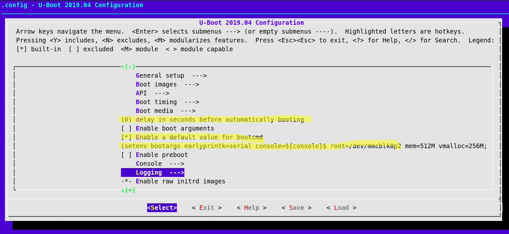

# HPC-Embedded-Project 1
### Assignment 1


# Ubuntu 18.04
* Virtual Box

# Git

```bash
sudo apt-get install git # Instalar el git
git clone https://github.com/manchii/hpc-emb-prj1
```

Comandos

```bash
git status				## Muestra el branch actual
git branch dj-b				## Crea un branch
git checkout dj-b			## Mueve a un branch designado
git merge develop			## Convina el directorio local y los archivos del branch
git config --global user.email "e-mail" #Configura correo
git config --global user.name "Name"	#Configura usuario
git add FILE				#Agrega informacion al commit
git commit FILE2Commit -m "Message"	#Compara Local y Branch se debe hacer antes del push
git push origin branchname		#Sube los cambios a Github
```


# Toolchain

```bash
sudo apt-get install gcc-arm-linux-gnueabihf
sudo apt-get install build-essential
sudo apt-get install bison
sudo apt-get install flex
```


# Emulador: QEMU ARM

Instalar el QEMU en Ubuntu 18.04

```bash
sudo apt-get install qemu-system-arm
```


# Bootloader: U-boot 2019.04

Descargar el release desde el repositorio

```bash
wget ftp://ftp.denx.de/pub/u-boot/u-boot-2019.04.tar.bz2
```

Descomprimir y desde el directorio compilar:

```bash
CROSS_COMPILE=arm-linux-gnueabihf- ARCH=arm
make vexpress_ca9x4_defconfig CROSS_COMPILE=arm-linux-gnueabihf- ARCH=arm
make all CROSS_COMPILE=arm-linux-gnueabihf- ARCH=arm
qemu-system-arm -machine vexpress-a9 -nographic -no-reboot -kernel u-boot

```
Para salir presionar CTRL+A y luego X

# Kernel: Linux 5.1

Descargar el release desde el repositorio

```bash
wget https://github.com/torvalds/linux/archive/v5.1.zip
```

Descomprimir y desde el directorio compilar:

```bash
make vexpress_defconfig CROSS_COMPILE=arm-linux-gnueabihf- ARCH=arm
make all CROSS_COMPILE=arm-linux-gnueabihf- ARCH=arm
```

# File-System: BusyBox

Descargar el release desde el repositorio

```bash
wget https://github.com/mirror/busybox/archive/1_30_1.zip
```

Descomprimir y desde el directorio compilar:

```bash
sudo apt-get install libncurses5-dev
sudo apt-get install libncursesw5-dev
```

```bash
mkdir bb_build
make O=bb_build/ defconfig CROSS_COMPILE=arm-linux-gnueabihf- ARCH=arm
make O=bb_build/ menuconfig CROSS_COMPILE=arm-linux-gnueabihf- ARCH=arm
```
Marcar con 'y' en el menuconfig
* Seleccionar Settings -> (*) Build static binary (no shared libs)

```bash
make O=bb_build/ CROSS_COMPILE=arm-linux-gnueabihf- ARCH=arm
cd bb_build/
make CROSS_COMPILE=arm-linux-gnueabihf- ARCH=arm
make install CROSS_COMPILE=arm-linux-gnueabihf- ARCH=arm
cd ../../ # sale de BusyBox

# Hacer el ramdisk

mkdir initramfs
cd initramfs
mkdir etc && mkdir proc && mkdir sys
sudo mkdir -p dev/
sudo mknod dev/tty1 c 4 1
sudo mknod dev/tty2 c 4 2
sudo mknod dev/tty3 c 4 3
sudo mknod dev/tty4 c 4 4
sudo mknod dev/console c 5 1
sudo mknod dev/ttyAMA0 c 204 64
sudo mknod dev/null c 1 3
cp -av ../busybox-1_30_1/bb_build/_install/* ./
rm linuxrc
gedit init
```
Dentro del init se escribe el init script
```bash
#!/bin/sh
mount -t proc none /proc
mount -t sysfs none /sys
echo -e "Hello World\n"
exec /bin/sh
```

Ejecutar en directorio initramfs el siguiente comando

```bash
chmod +x init
find ./ -print0 | cpio --null -ov --format=newc  > initramfs.cpio
```

Corriendo QEMU probar Linux OS


```bash
cd linux-5.1
cp ../initramfs/initramfs.cpio ./
qemu-system-arm -machine vexpress-a9 -cpu cortex-a9 -dtb ./arch/arm/boot/dts/vexpress-v2p-ca9.dtb -kernel ./arch/arm/boot/zImage -nographic -m 512M -append "earlyprintk=serial console=ttyAMA0" -initrd initramfs.cpio
```

# Creando imagen virtual de SD

```bash
sudo apt-get install gparted
dd if=/dev/zero of=./imagensd.img bs=1M count=64
sudo losetup -a						#Muestra los loops en uso
sudo losetup /dev/loop12 imagensd.img	      #Utilizar un loop que no este en uso.
sudo gparted /dev/loop12 				# en vez de fdisk

# Device/Create Parition Table../GPT
# Crear partición de File system: FAT32 New Size: 32MB (Label: BOOT)
# Crear partición de File system: EXT3 New Size: 30MB (Label: rootfs)
# Presionar Check, Apply, Save Details
# Copiar archivos en FAT32 - BOOT
##  .../u-boot-2019.04/u-boot,
##  .../linux-5.1/arch/arm/boot/zImage
##  .../linux-5.1/arch/arm/boot/dts/vexpress-v2p-ca9.dtb
# copiar archivos
sudo cp -rp initramfs/* /media/${USER}/Label_EXT3
## Desmontar particiones
```

# Corriendo QEMU con imagen SD

```bash

qemu-system-arm -machine vexpress-a9 -cpu cortex-a9 -kernel u-boot-2019.04/u-boot -sd imagensd.img -nographic -m 512M
##Copiar 4 comandos en consola
fatload mmc 0 0x60000000 zImage
fatload mmc 0 0x60500000 vexpress-v2p-ca9.dtb
setenv bootargs earlyprintk=serial console=${console}$ root=/dev/mmcblk0p2 mem=512M vmalloc=256M
bootz 0x60000000 - 0x60500000
```

# Configurando el bootcmd para u-boot

```bash
cd u-boot-2019.04
make vexpress_ca9x4_defconfig CROSS_COMPILE=arm-linux-gnueabihf- ARCH=arm
make menuconfig CROSS_COMPILE=arm-linux-gnueabihf- ARCH=arm
# Configurar de la siguiente forma
# donde bootcmd se inicializa con el script
# setenv bootargs earlyprintk=serial console=${console}$ root=/dev/mmcblk0p2 mem=512M vmalloc=256M; fatload mmc 0 0x60000000 zImage; fatload mmc 0 0x60500000 vexpress-v2p-ca9.dtb; bootz 0x60000000 - 0x60500000
```

```bash
#Finalmente Exit y ...
make all CROSS_COMPILE=arm-linux-gnueabihf- ARCH=arm
```
